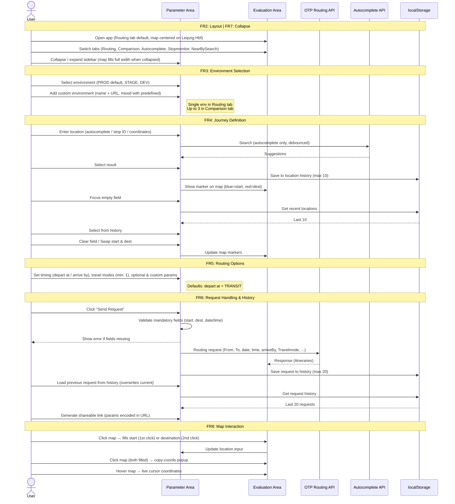

```mermaid
sequenceDiagram
    actor User
    participant PA as Parameter Area
    participant EA as Evaluation Area
    participant OTP as OTP Routing API
    participant API as Autocomplete API
    participant LS as localStorage

    note over User, LS: FR2: Layout | FR7: Collapse
    User->>EA: Open app (Routing tab default, map centered on Leipzig Hbf)
    User->>EA: Switch tabs (Routing, Comparison, Autocomplete, Stopmonitor, NearBySearch)
    User->>PA: Collapse / expand sidebar (map fills full width when collapsed)

    note over User, LS: FR3: Environment Selection
    User->>PA: Select environment (PROD default, STAGE, DEV)
    User->>PA: Add custom environment (name + URL, mixed with predefined)
    note right of PA: Single env in Routing tab<br/>Up to 3 in Comparison tab

    note over User, LS: FR4: Journey Definition
    User->>PA: Enter location (autocomplete / stop ID / coordinates)
    PA->>API: Search (autocomplete only, debounced)
    API-->>PA: Suggestions
    User->>PA: Select result
    PA->>LS: Save to location history (max 10)
    PA->>EA: Show marker on map (blue=start, red=dest)
    User->>PA: Focus empty field
    PA->>LS: Get recent locations
    LS-->>PA: Last 10
    User->>PA: Select from history
    User->>PA: Clear field / Swap start & dest
    PA->>EA: Update map markers

    note over User, LS: FR5: Routing Options
    User->>PA: Set timing (depart at / arrive by), travel modes (min. 1), optional & custom params
    note right of PA: Defaults: depart at + TRANSIT

    note over User, LS: FR6: Request Handling & History
    User->>PA: Click "Send Request"
    PA->>PA: Validate mandatory fields (start, dest, date/time)
    PA-->>User: Show error if fields missing
    PA->>OTP: Routing request (From, To, date, time, arriveBy, Travelmode, ...)
    OTP-->>EA: Response (itineraries)
    PA->>LS: Save request to history (max 20)
    User->>PA: Load previous request from history (overwrites current)
    PA->>LS: Get request history
    LS-->>PA: Last 20 requests
    User->>PA: Generate shareable link (params encoded in URL)

    note over User, LS: FR8: Map Interaction
    User->>EA: Click map → fills start (1st click) or destination (2nd click)
    EA->>PA: Update location input
    User->>EA: Click map (both filled) → copy-coords popup
    User->>EA: Hover map → live cursor coordinates
```
