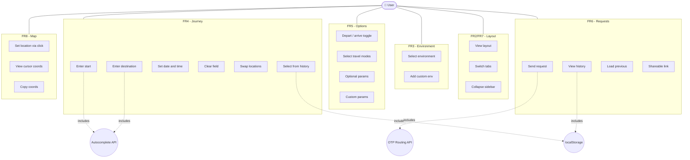

```mermaid
graph TB
    User(["🧑 User"])

    User --- G1
    User --- G2
    User --- G3
    User --- G4
    User --- G5
    User --- G6

    subgraph G1 [FR2/FR7 - Layout]
        UC1[View layout]
        UC2[Switch tabs]
        UC3[Collapse sidebar]
    end

    subgraph G2 [FR3 - Environment]
        UC4[Select environment]
        UC5[Add custom env]
    end

    subgraph G3 [FR4 - Journey]
        UC6[Enter start]
        UC7[Enter destination]
        UC8[Set date and time]
        UC9[Clear field]
        UC10[Swap locations]
        UC11[Select from history]
    end

    subgraph G4 [FR5 - Options]
        UC12[Depart / arrive toggle]
        UC13[Select travel modes]
        UC14[Optional params]
        UC15[Custom params]
    end

    subgraph G5 [FR6 - Requests]
        UC16[Send request]
        UC17[View history]
        UC18[Load previous]
        UC19[Shareable link]
    end

    subgraph G6 [FR8 - Map]
        UC20[Set location via click]
        UC21[View cursor coords]
        UC22[Copy coords]
    end

    API((Autocomplete API))
    OTP((OTP Routing API))
    LS((localStorage))

    UC6 -.->|includes| API
    UC7 -.->|includes| API
    UC16 -.->|includes| OTP
    UC11 -.->|includes| LS
    UC17 -.->|includes| LS
```
