# OTP Client v2 — Detailed Component Architecture

**Project:** LVB OTP Routing Workbench
**Version:** Sprint 2 (Feb 2026)
**Audience:** Developers, Code Reviewers, Technical Architects
**Status:** Current — reflects all completed FRs through Sprint 2
**Architecture Type:** Component-Based Architecture with Centralized State (React props/callbacks pattern)

---

## Overview

This document provides a full component-level breakdown of the OTP Client v2. It shows the **component hierarchy**, **state flow**, **library dependencies**, **external API calls**, and **localStorage interactions**.

The architecture follows a strict **top-down props / bottom-up callbacks** pattern. All shared state lives in `page.tsx`, which acts as the single state hub for the entire application.

---

## Component Architecture Diagram

```mermaid
flowchart LR
    classDef appShell    fill:#2C3E50,stroke:#1A252F,color:#FFFFFF
    classDef stateHub    fill:#FBC10F,stroke:#B8860B,color:#1A1A1A,font-weight:bold
    classDef paramComp   fill:#2471A3,stroke:#154360,color:#FFFFFF
    classDef evalComp    fill:#117A65,stroke:#0B5345,color:#FFFFFF
    classDef mapComp     fill:#0B5345,stroke:#063B30,color:#FFFFFF
    classDef resultComp  fill:#1A5276,stroke:#0D3349,color:#FFFFFF
    classDef libApi      fill:#1E8449,stroke:#145A32,color:#FFFFFF
    classDef libUtil     fill:#28B463,stroke:#1D8348,color:#1A1A1A
    classDef hookNode    fill:#16A085,stroke:#0E6655,color:#FFFFFF
    classDef storageNode fill:#7D3C98,stroke:#5B2C6F,color:#FFFFFF
    classDef externalApi fill:#BA4A00,stroke:#7E5109,color:#FFFFFF

    %% ── App Shell ──────────────────────────────────────────
    subgraph SHELL["App Shell  (src/app/)"]
        direction TB
        LAYOUT["layout.tsx\nRoot layout\nGeist fonts  +  Header slot"]
        HEADER["Header.tsx\nLVB logo  +  app title\nTheme toggle slot"]
        THEME["ThemeToggle.tsx\nDark / Light / System\nPersists to localStorage"]
    end

    %% ── State Hub ───────────────────────────────────────────
    PAGE["page.tsx\nApplication State Hub\n──────────────────────────────\nJourney: start, dest, dateTime\nEnvironment: selected, custom, autocomplete\nResults: routingResult, routingError, isLoading\nComparison: comparisonResults, comparisonSelected\nInteraction: hoveredLegIndex, selectedItineraryIndex\nHistory: requestHistory\nURL: urlInitialized, linkCopied"]

    %% ── Parameter Area ──────────────────────────────────────
    subgraph PARAM["  ParameterArea.tsx\n  Collapsible  •  Drag-resizable width (vw-based)  "]
        direction TB
        ENV_SEL["EnvironmentSelector.tsx\n──────────────────\nDual env: OTP + Autocomplete\nPROD / STAGE / DEV / Custom\nSingle or multi-select mode\ngetEnvironmentConfig()\ngetAutocompleteConfig()"]

        subgraph JFORM_GROUP["  JourneyForm.tsx  "]
            direction TB
            JFORM["JourneyForm.tsx\n──────────────────\nSubmit button\nValidation error display\nCopy shareable link"]
            LOC_IN["LocationInput.tsx\n──────────────────\nInput modes:\nAutocomplete search\nStop ID entry\nCoordinates entry\nLocation history dropdown\nReverse geocode label"]
            DT_IN["DateTimeInput.tsx\n──────────────────\nDate + time inputs\nNow shortcut button\ngetBerlinNow()"]
            HIST["RequestHistoryList.tsx\n──────────────────\nLast 20 requests\nLoad request\nClear all history"]
        end

        ROPTS["RoutingOptionsForm.tsx\n──────────────────\n20 travel modes with icons\nDepart at / Arrive by toggle\nOptional params checkboxes\nFree-text custom params\nCollapsible DisclosurePanel sections"]
    end

    %% ── Evaluation Area ─────────────────────────────────────
    subgraph EVAL["  EvaluationArea.tsx\n  Layout toggle (vertical / horizontal)  •  Draggable split divider (%)  "]
        direction TB
        TABS["Tabs.tsx\n──────────────────\nRouting\nRouting Comparison\nAutocomplete\nStop Monitor\nNearby Search"]

        subgraph MAP_SYS["  Map Subsystem  "]
            direction TB
            DML["DynamicMapLoader.tsx\nSSR-safe dynamic import\n(Leaflet requires DOM)"]
            MV["MapView.tsx\n──────────────────\nLeaflet map container\nDark mode: CSS filter on\n.leaflet-tile-pane only\nDefault center: Leipzig Hbf"]
            ME["MapEvents.tsx\nClick handler\nFill start then dest\nThen copy popup"]
            MM["MapMarkers.tsx\nStart marker (blue)\nDest marker (red)\nPermanent name labels\nTheme-aware icons"]
            RP["RoutePolylines.tsx\nLeg polylines\nMode-based colors\nHover highlighting\nvia hoveredLegIndex"]
            CT["CursorTracker.tsx\nLive lat/lon display\nUpdates on mouse move"]
            CP["CoordPopup.tsx\nCopy coordinates popup\nAppears on 3rd click"]
        end

        subgraph RESULTS_SYS["  Results Subsystem  "]
            direction TB
            RR["RoutingResults.tsx\n──────────────────\nItinerary list overview\nTransfer scheme bars\nJSON viewer tab\nCopy JSON to clipboard\nEarlier / Later buttons\nComparison column layout"]
            IC["ItineraryCard.tsx\n──────────────────\nExpandable leg rows\nTransitLegDetail component\nWalkLegDetail component\nStopRow component\nAlertList component\nRealtime vs planned times\nTariff zone badges\nTrip products + headsign\nDelay formatting"]
        end
    end

    %% ── Library Layer ────────────────────────────────────────
    subgraph LIBR["  src/lib/  —  Utility Library Layer  "]
        direction TB
        RL["routing.ts\n──────────────\nfetchRouting()\nOTP GraphQL POST\nFull response types:\nItinerary, Leg, Alert\nTransitLeg, NonTransitLeg\nStation, FromToLocation\nZoneInfo, BikeInfo\n30s timeout + error types"]
        AL["autocomplete.ts\n──────────────\nsearchLocations()\nLVB Autocomplete REST\nAccepts baseUrl + apiKey\n5s timeout"]
        VL["validation.ts\n──────────────\nvalidateRoutingParams()\nMandatory field checks\nReturns ValidationError[]"]
        RHL["requestHistory.ts\n──────────────\ngetRequestHistory()\naddToRequestHistory()\nclearRequestHistory()\ngenerateDisplayLabel()\nmax 20 entries"]
        URLP["urlParams.ts\n──────────────\nserializeFormState()\ndeserializeUrlParams()\nAll params in query string"]
        LH_LIB["locationHistory.ts\n──────────────\ngetLocationHistory()\naddToLocationHistory()\nmax 10 per field"]
        RGC["reverseGeocode.ts\n──────────────\nreverseGeocode()\nNominatim REST GET\nMap click to address"]
        LU["legUtils.ts\n──────────────\nMODE_COLORS\nMODE_LABELS\ngetLegColor()\nformatTimestamp()\nformatDuration()\nformatDelay()\nformatDistance()\nformatAlertCategory()\ngetUniqueProducts()"]
        TU["timelineUtils.ts\n──────────────\ncomputeTimelineRange()\ntimeToY()\ndurationToHeight()\ncomputeTotalHeight()\ngenerateHourMarkers()\nDEFAULT_PIXELS_PER_MINUTE"]
        ISD["useIsDark.ts\n──────────────\nuseIsDark() hook\nMutationObserver on html\nprefers-color-scheme\nCanonical dark mode"]
    end

    %% ── Browser Storage ──────────────────────────────────────
    subgraph LS["  Browser localStorage  "]
        direction TB
        LSH["request_history\nJSON array, max 20\nRequestHistoryEntry[]"]
        LSLOC["location_history\nJSON array, max 10\nLocationValue[]"]
        LSTHEME["theme\n'dark' / 'light'\nor absent (system)"]
    end

    %% ── External APIs ────────────────────────────────────────
    subgraph EXTAPI["  External Services  "]
        direction TB
        OTP_E["LVB OTP Routing API\n──────────────\nGraphQL POST\nPROD / STAGE / DEV\nPer-env URL + API key\n30 second timeout"]
        AUTO_E["LVB Autocomplete API\n──────────────\nREST GET  /search\nDebounced 300 ms\n5 second timeout"]
        NOM_E["Nominatim API\n──────────────\nREST GET  /reverse\nOpenStreetMap\nTriggered on map click"]
    end

    %% ── Connections: App Shell ───────────────────────────────
    LAYOUT --> HEADER
    LAYOUT --> PAGE
    HEADER --> THEME

    %% ── Connections: State Hub → Areas ───────────────────────
    PAGE -->|"props: start, dest, dateTime\nroutingOptions, errors\nenvironments, history"| PARAM
    PAGE -->|"props: routingResult\ncomparisonResults\nhoveredLegIndex\nselectedItineraryIndex"| EVAL

    %% ── Connections: Parameter Area internals ────────────────
    JFORM --> LOC_IN
    JFORM --> DT_IN
    JFORM --> HIST

    %% ── Connections: Evaluation Area internals ───────────────
    EVAL --> TABS
    EVAL --> DML
    EVAL --> RR
    DML --> MV
    MV --> ME
    MV --> MM
    MV --> RP
    MV --> CT
    MV --> CP
    RR --> IC

    %% ── Connections: Lib usage ───────────────────────────────
    PAGE     -->|"fetchRouting()\nper-env config"| RL
    PAGE     -->|"validateRoutingParams()"| VL
    PAGE     -->|"history CRUD"| RHL
    PAGE     -->|"URL serialize / deserialize"| URLP
    LOC_IN   -->|"searchLocations()"| AL
    LOC_IN   -->|"recent locations CRUD"| LH_LIB
    ME       -->|"reverseGeocode()"| RGC
    IC       -.->|"getLegColor\nformatDuration\nformatDelay\nformatTimestamp"| LU
    RP       -.->|"getLegColor"| LU
    EVAL     -.->|"timeline layout\ncalculations"| TU
    EVAL     -.->|"useIsDark()"| ISD
    IC       -.->|"useIsDark()"| ISD
    MM       -.->|"useIsDark()"| ISD

    %% ── Connections: External API calls ─────────────────────
    RL     -->|"POST /graphql"| OTP_E
    AL     -->|"GET /search"| AUTO_E
    RGC    -->|"GET /reverse"| NOM_E

    %% ── Connections: localStorage ────────────────────────────
    RHL    <-->|"read / write"| LSH
    LH_LIB <-->|"read / write"| LSLOC
    THEME  <-->|"read / write"| LSTHEME

    %% ── Class assignments ────────────────────────────────────
    class LAYOUT,HEADER appShell
    class THEME storageNode
    class PAGE stateHub
    class ENV_SEL,JFORM,LOC_IN,DT_IN,HIST,ROPTS paramComp
    class TABS,EVAL evalComp
    class DML,MV,ME,MM,RP,CT,CP mapComp
    class RR,IC resultComp
    class RL,AL,VL,RHL,URLP,LH_LIB,RGC libApi
    class LU,TU libUtil
    class ISD hookNode
    class LSH,LSLOC,LSTHEME storageNode
    class OTP_E,AUTO_E,NOM_E externalApi
```



---

## Color Legend

| Color | Category | Nodes |
|:------|:---------|:------|
| **Dark Charcoal** | App Shell | `layout.tsx`, `Header.tsx` |
| **LVB Yellow** | State Hub | `page.tsx` — all state lives here, single source of truth |
| **Blue** | Parameter Area Components | `EnvironmentSelector`, `JourneyForm`, `LocationInput`, `DateTimeInput`, `RequestHistoryList`, `RoutingOptionsForm` |
| **Teal** | Evaluation Area Components | `EvaluationArea`, `Tabs` |
| **Dark Green** | Map Subsystem | `DynamicMapLoader`, `MapView`, `MapEvents`, `MapMarkers`, `RoutePolylines`, `CursorTracker`, `CoordPopup` |
| **Navy** | Results Subsystem | `RoutingResults`, `ItineraryCard` |
| **Green (dark)** | API Client Libraries | `routing.ts`, `autocomplete.ts`, `validation.ts`, `requestHistory.ts`, `urlParams.ts`, `locationHistory.ts`, `reverseGeocode.ts` |
| **Green (light)** | Utility Libraries | `legUtils.ts`, `timelineUtils.ts` |
| **Teal (muted)** | React Hooks | `useIsDark.ts` |
| **Purple** | Browser Storage | `localStorage` keys |
| **Orange** | External Services | OTP Routing API, Autocomplete API, Nominatim |

**Arrow types:**
- `-->` solid arrows: direct prop passing, function calls, API calls
- `-.->` dashed arrows: utility usage (imported and called, no prop threading)

---

## Data Flow Summary

### Journey Request Flow

```
Developer input
  → JourneyForm (start, dest, dateTime, options)
    → page.tsx validates via validation.ts
      → fetchRouting() in routing.ts
        → OTP Routing API (POST /graphql)
          → RoutingResponse returned to page.tsx
            → passed as props to EvaluationArea
              → RoutingResults renders itinerary list
                → ItineraryCard renders leg detail
                  → RoutePolylines renders on map
```

### Location Autocomplete Flow

```
Developer types in LocationInput
  → searchLocations() in autocomplete.ts  (debounced 300 ms)
    → LVB Autocomplete API (GET /search)
      → suggestions rendered in dropdown
        → selection stored in locationHistory.ts
          → recent locations shown on next focus
```

### Comparison Flow (FR13–FR16)

```
Developer selects 2–3 environments, clicks Compare
  → page.tsx fires Promise.allSettled() — one fetchRouting() per environment
    → results stored in comparisonResults: Record<envId, ...>
      → passed to EvaluationArea
        → rendered as side-by-side columns (horizontal) or vertical timeline
          → hover/select syncs map via comparisonMapItinerary
```

### URL State Sync Flow

```
Any form state change
  → page.tsx debounced (300 ms)
    → serializeFormState() in urlParams.ts
      → window.history.replaceState()  (no page reload)
        → shareable link is always current
```

---

## Component Responsibility Matrix

| Component | Renders | Manages State | External Calls |
|:----------|:--------|:-------------|:---------------|
| `page.tsx` | layout only | ALL shared state | via lib functions |
| `ParameterArea.tsx` | collapsible shell | width (drag) | — |
| `EnvironmentSelector.tsx` | env picker UI | — | — |
| `JourneyForm.tsx` | form shell + submit | — | — |
| `LocationInput.tsx` | input + dropdown | input text, open state | `searchLocations()`, `reverseGeocode()` |
| `DateTimeInput.tsx` | date/time fields | — | — |
| `RequestHistoryList.tsx` | history list | — | — |
| `RoutingOptionsForm.tsx` | options UI | disclosure open states | — |
| `EvaluationArea.tsx` | layout + split | split % , layout mode | — |
| `MapView.tsx` | Leaflet container | — | — |
| `MapEvents.tsx` | invisible event layer | — | `reverseGeocode()` |
| `MapMarkers.tsx` | start/dest markers | — | — |
| `RoutePolylines.tsx` | leg polylines | — | — |
| `RoutingResults.tsx` | itinerary list + JSON | view mode, copy state | — |
| `ItineraryCard.tsx` | leg detail | expanded state per leg | — |

---

## Sprint 2 Additions vs Sprint 1 Baseline

| Feature | Sprint | Key Components Added |
|:--------|:-------|:--------------------|
| Results layout toggle + draggable split | 2 (FR9) | `EvaluationArea` split logic |
| Itinerary overview with transfer scheme | 2 (FR10) | `RoutingResults` overview bars |
| Itinerary detail — stops, realtime, zones | 2 (FR11) | `ItineraryCard` + sub-components |
| JSON viewer, copy, earlier/later | 2 (FR12) | `RoutingResults` JSON tab |
| Routing comparison (up to 3 envs) | 2 (FR13) | `comparisonResults` state + comparison columns |
| Comparison hover/select + map sync | 2 (FR14) | `comparisonMapItinerary` derived state |
| Vertical timeline layout | 2 (FR15) | `timelineUtils.ts` + timeline rendering in `EvaluationArea` |
| Horizontal Gantt overview | 2 (FR16) | Gantt bars with itinerary data in `EvaluationArea` |
