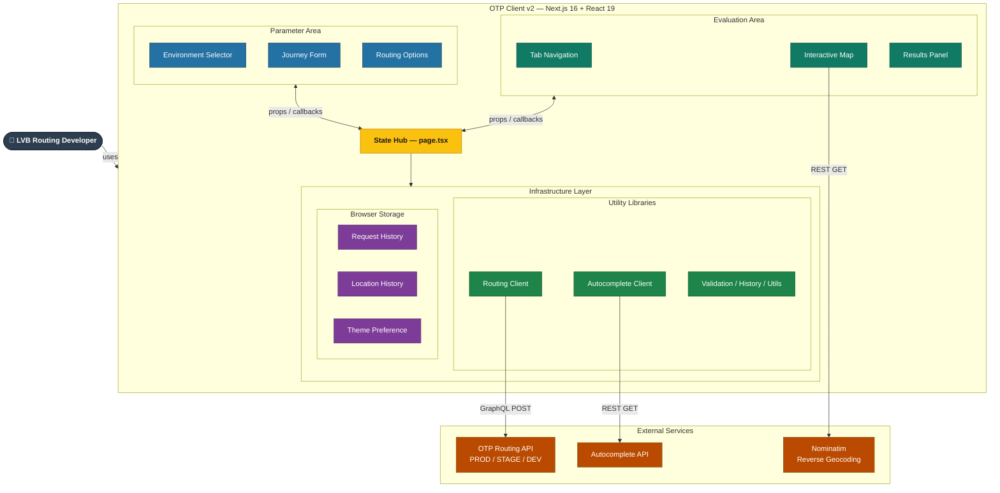

# OTP Client v2 — High-Level System Architecture

**Project:** LVB OTP Routing Workbench
**Version:** Sprint 2 (Feb 2026)
**Audience:** Stakeholders, Product Owners, Technical Leads
**Status:** Current — reflects all completed FRs through Sprint 2
**Architecture Type:** Layered Client-Side SPA (Browser-Native N-Tier)

---

## Overview

The OTP Client v2 is a browser-based internal tool for LVB routing developers to **test, inspect, and compare** routing API responses across deployment environments. The application is a single-page Next.js client that communicates directly with LVB backend services.

**Key characteristics:**

- Desktop-only, internal tool (~5 routing developers)
- All logic runs in the browser — no backend/BFF layer
- State is managed centrally in a single React component (`page.tsx`)
- Supports up to 3 simultaneous environments for side-by-side comparison (Sprint 2/3)

---

## System Architecture Diagram

---

## Color Legend

| Color | Layer | Description |
|:------|:------|:------------|
| **Dark Charcoal** | Actor | End user (LVB routing developer) |
| **Blue** | Parameter Area | Input components — environment, journey, routing options |
| **Green (teal)** | Evaluation Area | Output components — map, results, comparison |
| **LVB Yellow** | State Hub | `page.tsx` — central state management, all props flow through here |
| **Green** | Library Layer | Utility modules — API clients, validation, formatters, hooks |
| **Purple** | Browser Storage | `localStorage` — persisted request history, location history, theme |
| **Orange** | External Services | LVB APIs and third-party services called directly from the browser |

---

## Functional Requirements Coverage

| FR | Feature | Sprint | Area |
|:---|:--------|:-------|:-----|
| FR2 | Application layout (Parameter + Evaluation Areas) | 1 | App Shell |
| FR3 | Environment selection — PROD/STAGE/DEV + custom | 1 | Parameter Area |
| FR4 | Journey definition — locations, date/time | 1 | Parameter Area |
| FR5 | Routing options — modes, timing, optional params | 1 | Parameter Area |
| FR6 | Request handling — submit, validate, history, shareable links | 1 | State Hub |
| FR7 | Parameter area collapse/expand | 1 | Parameter Area |
| FR8 | Interactive map — click to set, cursor coords, copy popup | 1 | Evaluation Area |
| FR9 | Results layout — toggle + draggable split view | 2 | Evaluation Area |
| FR10 | Results overview — itinerary list with transfer scheme | 2 | Evaluation Area |
| FR11 | Itinerary detail — stops, realtime, tariff zones, leg hover | 2 | Evaluation Area |
| FR12 | Advanced info — JSON viewer, copy, earlier/later pagination | 2 | Evaluation Area |
| FR13 | Routing comparison — up to 3 environments | 2 | State Hub + Evaluation Area |
| FR14 | Comparison interaction — hover/select, map sync | 2 | State Hub + Evaluation Area |
| FR15 | Vertical timeline layout | 2 | Evaluation Area |
| FR16 | Horizontal Gantt overview | 2 | Evaluation Area |

---

## Key Architecture Decisions

| Decision | Rationale |
|:---------|:----------|
| **No backend / BFF layer** | Internal tool; API keys acceptable in `.env`; no public exposure |
| **State lifted to `page.tsx`** | Single source of truth; simplifies map ↔ form coordination and comparison mode |
| **Client components only** (`"use client"`) | Leaflet requires DOM; all components are interactive; no SSR penalty needed |
| **Per-environment API calls** | `fetchRouting()` accepts `{ baseUrl, apiKey }` options — no global config |
| **localStorage for persistence** | No user accounts; browser storage is sufficient for history and preferences |
| **Dual environment selection** | OTP routing env and Autocomplete env can differ (e.g., STAGE routing + PROD autocomplete) |
| **URL state sync** | All form state serialised to query params — enables shareable links without a backend |
