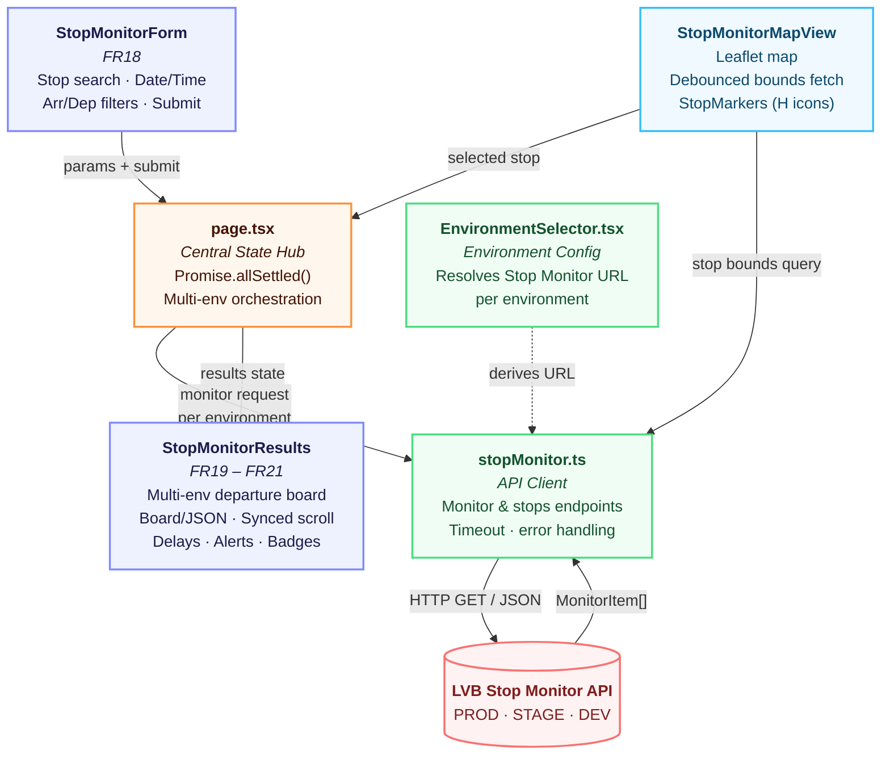
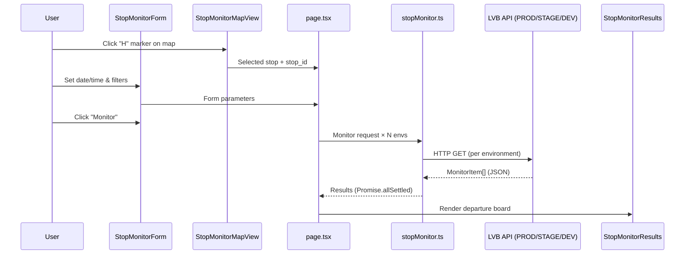
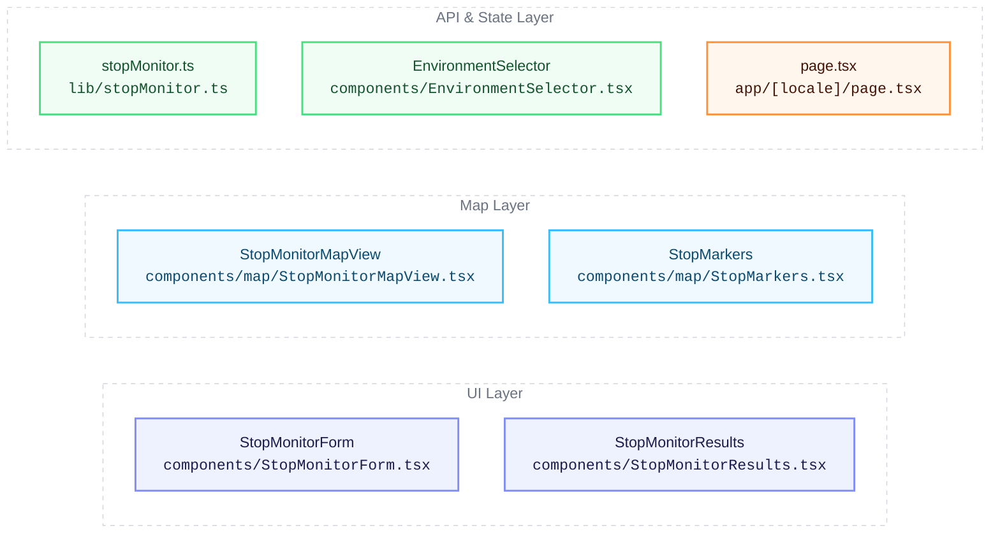

# Stop Monitor — Component Architecture

> **Sprint 3** · OTP Client v2.0 · Ayman Kandouli

---

## Architecture Overview

### Legend

- **Purple** — UI Components (StopMonitorForm, StopMonitorResults)
- **Orange** — State Management (page.tsx)
- **Green** — API & Config (stopMonitor.ts, EnvironmentSelector.tsx)
- **Blue** — Interactive Map (StopMonitorMapView, StopMarkers)
- **Red** — External Service (LVB Stop Monitor API)

---

## Data Flow

---

## Functional Requirements

| FR | Title | Description |
|----|-------|-------------|
| **FR18** | Stop Monitor Form | Stop search (autocomplete + map click), date/time picker, arrival-only / departure-only filters |
| **FR19** | Departure Board | Multi-environment departure board with realtime delays and cancellation badges |
| **FR20** | View Toggle | Board / JSON view toggle, copy JSON to clipboard, synchronized scroll across env columns |
| **FR21** | Detail Display | Track changes, service alerts with category badges, per-environment labels |

---

## Key Components

---

## Additional Sprint 3 Deliverables

| Area | Detail |
|------|--------|
| **E2E Tests** | 8 new Selenium tests for Stop Monitor (40 total), GitHub Actions CI |
| **i18n** | Full EN/DE translations for all Stop Monitor UI via `next-intl` |
| **Unit Tests** | Stop Monitor form visibility, submission, and results handling |
